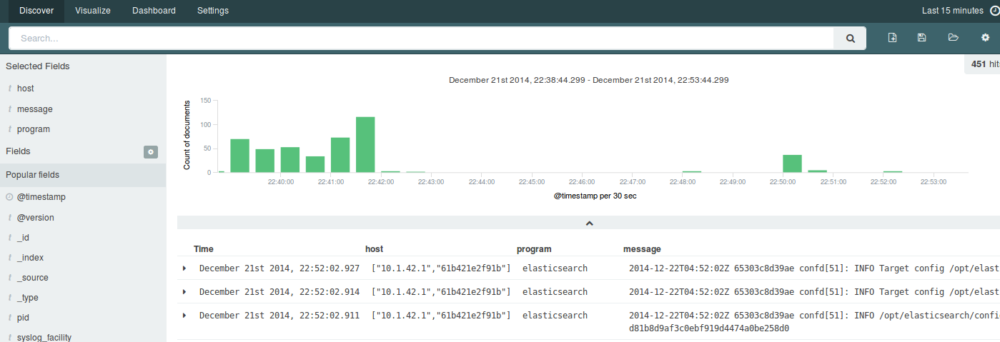

Elasticsearch/Logstash/Kibana on Docker
=======================================

This project is a attempt to showcase using the CoreOS suite of tools ( CoreOS, etcd, fleet, confd ) to build and deploy an ELK (Elasticsearch, Logstash, Kibana) cluster.

I have borrowed heavily from the fine folks from the [deis](https://github.com/deis/deis) project which uses similar concepts to set and configure up its infrastructure.



Framework
=========

There is a base `Dockerfile` for building a `java` image with `confd` and `etcd` installed.

Each ELK system has a directory which containera `Dockerfile` that builds upon the `java` image to install the system itself.   It also contains a startup script and the templates requires to configure itself.

Components
==========

Elasticsearch
-------------

Each Elasticsearch image will register itself with etcd in `/services/elasticsearch/hosts` as well as store some config data in `/services/elasticsearch/config`.

Most settings are still defaults right now, and memory is restricted to 512mb for the sake of POC.

`confd` will create an `elasticsearch.yml` config file which sets the cluster name and disabled multicast discovey.  It uses unicast discovery and uses details from `services/elasticsearch/host` to figure out who to talk to.

```
docker run  -d  -p 9200:9200 -p 9300:9300 -e PUBLISH=9200 \
  -e HOST=<ETCD_HOST> --name elasticsearch paulczar/elasticsearch_confd`
```

Logstash
--------

Logstash is fairly static right now.   it will listen on syslog port 514 ( tcp and udp ) and attempt to filter standard syslog lines with grok filters.    It currently outputs to elasticsearch via http to the elasticsearch node onthe current host.   It will  not be difficult to provide it a list from the `/services/elasticsearch/hosts` etcd namespace in the future.

```
docker run  -d  -p 514:514 -p 514:514/udp -e PUBLISH=514 \
          -e HOST=<ETCD_HOST> --name logstash paulczar/logstash_confd
```

Kibana
------

Kibana will listen on port 5601 and talk to the elasticsearch node running on the same host.  Like logstash it will not be hard to modify it to take information from etcd for this.

```
docker run  -d  -p 514:514 -p 514:514/udp -e PUBLISH=514 \
          -e HOST=<ETCD_HOST> --name kibana paulczar/kibana_confd
```

Logspout
--------

Finally each host will run logspout to collect all of the logs coming from the `ELK` containers and push them into `Elasticsearch` so that they are viewable in `Kibana`.


Testing / Development
=====================

Vagrant
-------

There is a comprehensive `Vagrantfile` that will spin up 3 CoreOS nodes, build, and then run the ELK images.

The first CoreOS node is special..  it will start a private docker registry and then build the images for the elk systems before uploading them to the private registry and then starting them.  This registry and the images it stores will be cached on your host in `./registry` to help speed up subsequent runs.  You mean want to clean it out if you're messing with the images and rebuilding by running `./clean_registry`.

The other two nodes will then pull these built images down from the private registry and run them.

Vagrant will also expose the ports for the services.

```
$ vagrant up
...
...
$ curl http://localhost:9200/_cluster/health?pretty=true
{
  "cluster_name" : "elasticsearch",
  "status" : "green",
  "timed_out" : false,
  "number_of_nodes" : 3,
  "number_of_data_nodes" : 3,
  "active_primary_shards" : 0,
  "active_shards" : 0,
  "relocating_shards" : 0,
  "initializing_shards" : 0,
  "unassigned_shards" : 0
}
$ curl  http://localhost:5601
<!DOCTYPE html>
  <!--[if IE 8]>         <html class="no-js lt-ie9" lang="en"> <![endif]-->
  <!--[if gt IE 8]><!--> <html class="no-js" lang="en"> <!--<![endif]-->
  <head>
    <meta charset="utf-8">
    <meta http-equiv="X-UA-Compatible" content="IE=edge,chrome=1">
    <meta name="viewport" content="width=device-width">
    <link rel="shortcut icon" href="/styles/theme/elk.ico">
    <title>Kibana 4</title>

    <script>
      window.KIBANA_VERSION='4.0.0-beta3';
      window.KIBANA_BUILD_NUM='4673';
      window.KIBANA_COMMIT_SHA='8faae21c4d8208dd9dc6da97d8a492666aaa9ef1';
    </script>

    <link rel="stylesheet" href="/styles/main.css?_b=4673">
    <script src="/bower_components/requirejs/require.js?_b=4673"></script>
    <script src="/require.config.js?_b=4673"></script>
    <script>
      if (window.KIBANA_BUILD_NUM.substr(0, 2) !== '@@') {
        // only cache bust if this is really the build number
        require.config({ urlArgs: '_b=' + window.KIBANA_BUILD_NUM });
      }

      require(['kibana'], function (kibana) { kibana.init(); });
    </script>
  </head>
  <body kibana ng-class="'application-' + activeApp.id"></body>
</html>

$ cat /var/log/syslog | nc localhost 5014
```

By this time you have a three node elasticsearch cluster, logstash listening on each host on syslog ports and kibana running on each host.   The final line pushes syslog from your local machine into logstash and through to elasticsearch.  You can now use kibana to browse through that data.

There are also a number of functions loaded in via via the user-data script to make it easier to mess around with things.

* `start_[elasticsearch|logstash|kibana]` - start the chosen container
* `stop_[elasticsearch|logstash|kibana]` - stop the chosen container
* `[elasticsearch|logstash|kibana]` - get a bash prompt on the chosen container
* `cleanup` - remove the etcd keys used by ELK.


Author(s)
======

Paul Czarkowski (paul@paulcz.net)

License
=======

Copyright 2014 Paul Czarkowski

Licensed under the Apache License, Version 2.0 (the "License");
you may not use this file except in compliance with the License.
You may obtain a copy of the License at

    http://www.apache.org/licenses/LICENSE-2.0

Unless required by applicable law or agreed to in writing, software
distributed under the License is distributed on an "AS IS" BASIS,
WITHOUT WARRANTIES OR CONDITIONS OF ANY KIND, either express or implied.
See the License for the specific language governing permissions and
limitations under the License.
